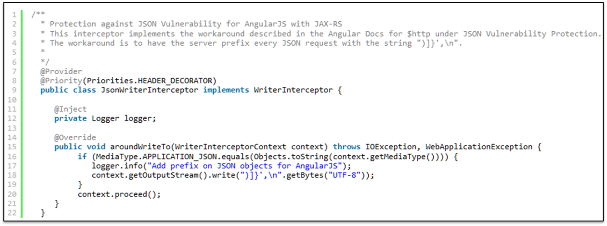

# 8.3 XSSI protection in Angular

Angular automatically strips the `)]}',\n` prefix if any
Configure your server to prefix: `)]}',\n` before all your JSON responses.

A normal response of `['one', 'two']` will be returned as :
``` typescript
)]}',
['one', 'two']
```
