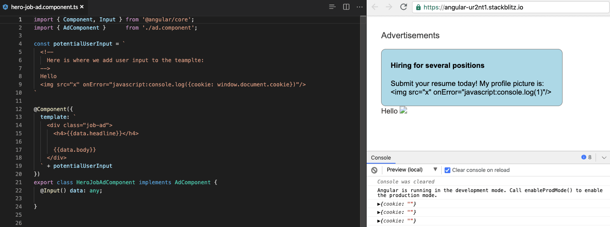

# 5.1 SSTI Overview

## SSTI in a nutshell

Server-Side Template Injection is an attack where a **malicious payload is injected into a template** which is then executed server-side.

## What are Templates ?

Templates allow to **pre-populate dynamic data from the server into a web page.**
Web pages coming from web templates can structure the component of web pages in such a way that can be modified independently of each other.
Templates are commonly used for:
- Displaying information about users (username, bio...), products, companies.
- Sending bulk emails.
- Displaying a gallery of photos or videos.

Example:

``` typescript
Hello {{user.name}}
```

## Example of vulnerable Angular Template



A malicious user can inject malicious code from unknown origin which will be executed in `potentialUserInput`.

Source: [https://snyk.io/blog/angular-security-best-practices/](https://snyk.io/blog/angular-security-best-practices/)


