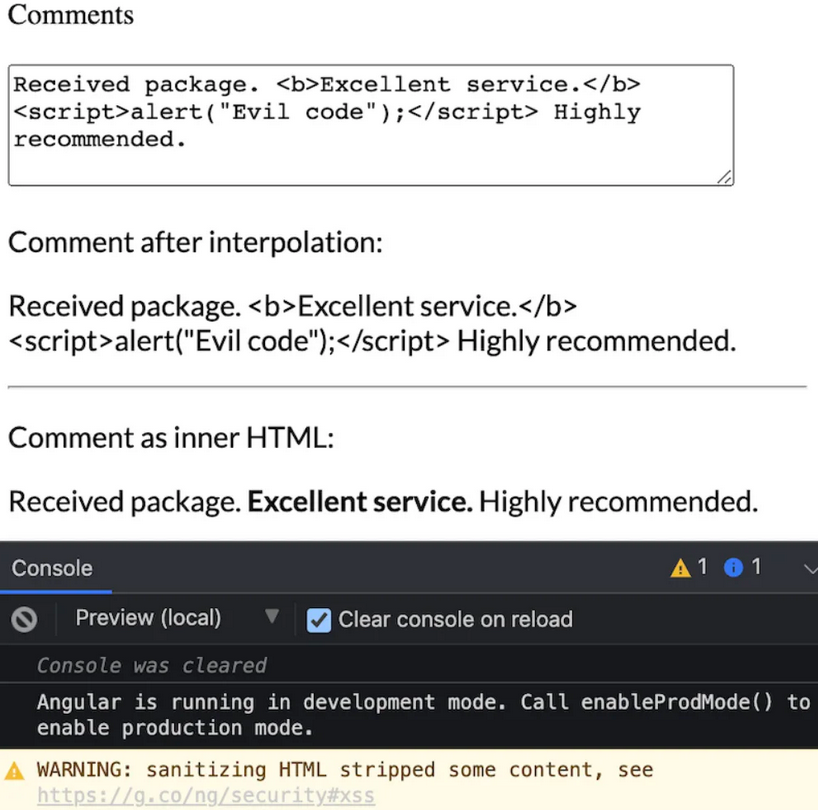

# 3.4 XSS Protection in Angular

## What are the XSS defense mechanisms available in Angular ?

### Angular Built in defense

The good news is that Angular treats all users inputs as untrusted data by default.

Therefore, it has an XSS defense by default.

### Contextual escaping


Angular displays any input (malicious or not) as plain text on your webpage.

It won't interpret the input as HTML (for example in comments) if you don't explicitly tell him to.

### Input Sanitization



Use angular properties to bind user inputs:

- `[innerHtml]`: binds html tags
- `[style]`: binds CSS attributes
- `[href]`: binds dynamic links

Angular will interpret the bound inputs if you explicitly use the corresponding property.

Angular automatically recognizes `<script>` tags as unsafe and removes it. A warning appears in the browser console to notify you if Angular has sanitized an input value.

### Input Sanitization Bypassing

::: warning
:warning: Use with care :warning:
:::

Sometimes application need to include executable code, display an iframe from an url or construct potentially dangerous urls...

:warning: You must discuss this use case with your Security Officer before going further. :warning:

If you really need to use validated user input in your application, you must mark it as trusted input.

You can use the byPassSecurityTrust...() functions from the DomSanitizer class:

``` typescript
abstract class DomSanitizer implements Sanitizer {
  abstract sanitize(context: SecurityContext, value: string | SafeValue): string | null
  abstract bypassSecurityTrustHtml(value: string): SafeHtml
  abstract bypassSecurityTrustStyle(value: string): SafeStyle
  abstract bypassSecurityTrustScript(value: string): SafeScript
  abstract bypassSecurityTrustUrl(value: string): SafeUrl
  abstract bypassSecurityTrustResourceUrl(value: string): SafeResourceUrl
}
```
## Further resources

[angular.io/guide/security#server-side-xss-protection](https://angular.io/guide/security#server-side-xss-protection)