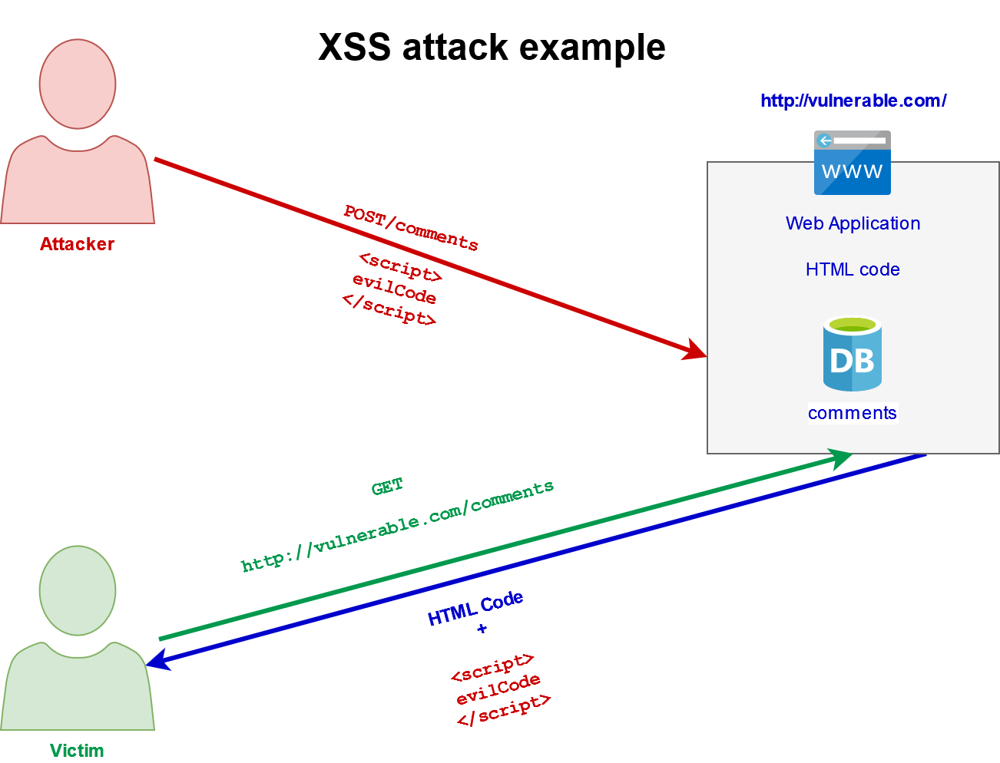

# 2.1 XSS Overview 

## XSS in a nutshell

XSS (Cross Site Scripting) happens when an attacker enters a malicious script in a web application through a web request.

The script is included in dynamic content that is reflected back to the victim's web browser without validation for malicious content.

## Why is XSS dangerous ?

The impact of XSS is moderate for reflected and DOM XSS, and severe for stored XSS, with remote code execution on the victim’s browser, such as stealing credentials, sessions, MFA bypass, DOM node replacement or defacement (such as trojan login panels), key logging or delivering malware to the victim.

## What causes XSS ?

This attack happens mostly because the web application or API uses inputs from any users within the output it generates without proper validation or encoding.

## How XSS attacks happen ?

| XSS type                  | Description                                                                                                        |  Payload type                  |  Payload Examples | Real cases                                                                                      |
|---------------------------|--------------------------------------------------------------------------------------------------------------------|--------------------------------|-------------------|-------------------------------------------------------------------------------------------------|
| Reflected                 | Reflected in web server as an error message, search result or any input sent to the server as part of the request. | From request parameter.        |                   |https://www.techspot.com/news/78304-epic-games-weaknesses-check-point-hack-fortnite-accounts.html|
| Stored                    | Injected script is permanently stored in target servers.                                                           | Stored server-side.            |                   |https://www.vice.com/en/article/wnjwb4/the-myspace-worm-that-changed-the-internet-forever        |
| DOM based                 | Modifying the DOM environment in the victim browser.                                                               | Introduced by DOM modification.|                   |https://www.neuralegion.com/blog/dom-based-xss/                                                  |
| Mutation                  | ?                                                                                                                  | Mutated by browser.            |                   |                                                                                                 |
| Blind Cross-Site scripting| Script is saved on server side and reflected back in the backend application.                                      |                                |                   |https://samcurry.net/cracking-my-windshield-and-earning-10000-on-the-tesla-bug-bounty-program/   |
