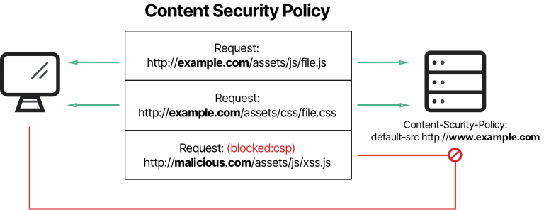

# 4.1 CSP Overview



Content Security Policy (CSP) is a W3C **standard** introduced to **prevent** cross-site-scripting, click-jacking and other **code injection attacks** resulting of malicious inputs in the trusted web page context.
CSP defines a standard methods for web application developers to **declare approved origins** of content that **browsers should allow loading**.

**CSP is a new browser security policy** :
- Defines **what it is allowed to happen** in a page
- Delivered by the server in a **response header** or meta tag 


::: warning
CSP is not intended as a first level of defense against code injection attacks like XSS. **CSP is best used as defense-in-depth.** 
It **reduces the risk** that malicious injection can cause, but it is **not a replacement** for careful input validation and output encoding.
:::

## Implementation

To enable CSP, you need to configure your web application to return the `Content-Security-Policy` HTTP header.


## CSP evolution to strict CSP

White-list CSP properties requires a lot of customization and **maintenance**.

CSP evolution with `script-src` directive :


A **nonce** is a random number generated for single usage to mark a `<script>` tag as trusted.

::: warning
Browsers still not support all CSP version 3 features.
Most recent browsers version support CSP version 2.
:::

## CSP common directives

- `default-src` : Default property if no other attributes are defined. In most cases, the value of this property is `default-src 'self'`  meaning the browser can only upload resources from the current website. 
  
- `script-src` : Defines locations from which external scripts can be loaded. If your web application does not use client-side scripting, set the value to `script-src 'none'`.
    
- `img-src` : Defines locations from which images can be retrieved.
    
- `media-src` : Defines locations from which rich media like video can be retrieved.
    
- `object-src` : Defines locations from which plugins can be retrieved.
    
- `manifest-src` : Defines locations from which application manifests can be retrieved.
    
- `frame-ancestors` : Defines locations from which another web page can be loaded using a frame, iframe, object, embed, or applet element.
    
- `form-action` : Specifies URLs that can be used as part of an action in a `<form>` tag, meaning the browser restricts where form results can be sent. The form action does not revert to `default-src`, so this is a mandatory property if you are using form elements on your site.
    
- `plugin-types` : Identifies the set of plugins that can be invoked via objects, embeds, or applets, defined using MIME types.
    
- `base-uri` : Allows URLs in the src attribute of any tag.
  
- `report-uri`: Instructs the browser to POST a reports of policy failures to this URI. 
You can also use **Content-Security-Policy-Report-Only** as the HTTP header name to instruct the browser to only send reports (does not block anything). 
This directive is deprecated in CSP Level 3 in favor of the report-to directive.

::: warning
As of today, some CSP properties **may not be supported by all browsers**. IE is known to have limited support for CSP.
You can verify the compatibility of CSP properties with browser with several online tools like this one: [https://caniuse.com/?search=csp](https://caniuse.com/?search=csp)
:::

## CSP Common Source List Values

- `*`: Wildcard, allows any URL except data: blob: filesystem: schemes
- `none`: Prevents loading resources from any source, even from your own!
- `self` : Allows loading resources from the same origin (same scheme, host and port).
- `unsafe-inline` : Allows use of inline source elements such as style attribute, onclick, or script tag bodies and javascript: URIs. This value is as it says : unsafe !
- `nonce-rAnd0m` : Allows an inline script or CSS to execute if the script (eg: `<script nonce="rAnd0m">`) tag contains a nonce attribute matching the nonce specified in the CSP header. The nonce should be a secure random string, and should not be reused.
- `strict-dynamic` : Allows scripts to be included by any script already marked by a nonce or hash.  Disables the whitelist and allows backward compatibility with CSP v1 and v2 as shown bellow:
  
## Common white-list CSP example

``` typescript
Content-Security-Policy: 
  default-src 'self'; 
  style-src 'unsafe-inline' 'self' https://fonts.googleapis.com https://themes.googleusercontent.com;
  frame-src https://www.slideshare.net www.youtube.com twitter.com; 
  object-src 'none'; 
  font-src 'self' data: https://themes.googleusercontent.com https://fonts.googleapis.com; 
  script-src 'strict-dynamic' 'nonce-rAnd0m123' 'unsafe-inline' 'self' https://www.google.com twitter.com https://themes.googleusercontent.com;
  base-uri 'none'; 
  img-src 'self' https://www.google.com data: https://pbs.twimg.com https://img.youtube.com twitter.com
```

::: tip
[This online tool](https://csper.io/evaluator) or [this one](https://csp-evaluator.withgoogle.com/) can help you evaluate the strength of your CSP.
:::

To learn further about CSP, don't hesitate to check [there Quick Reference Guide](https://content-security-policy.com/).

